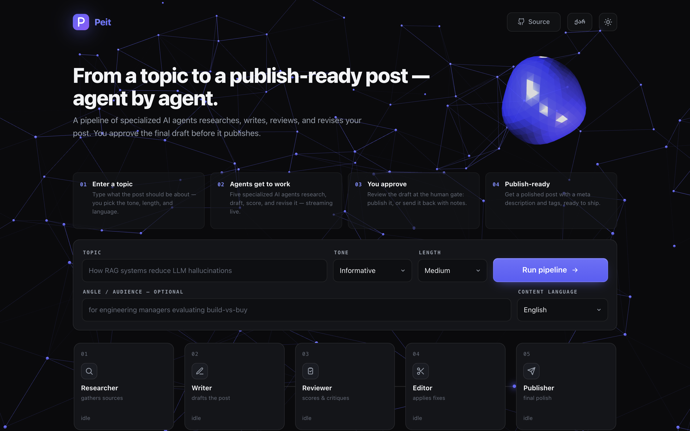
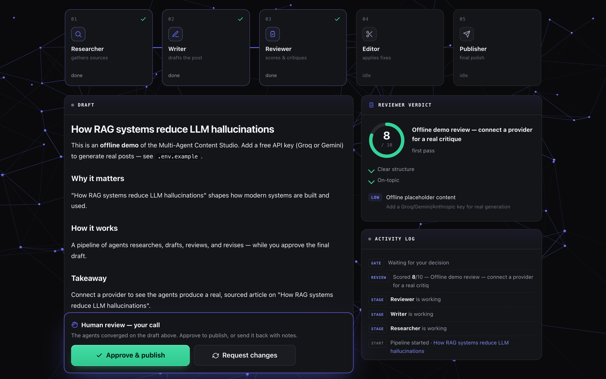

# Peit — Multi-Agent Content Studio

**Turn a topic into a publish-ready blog post — written, reviewed, and revised by a
pipeline of five AI agents, with you approving the final draft.**

[](https://github.com/tornikepe/multi-agent-content-studio/actions/workflows/ci.yml)
[](LICENSE)


🔗 **Live demo:** [multi-agent-content-studio.vercel.app](https://multi-agent-content-studio.vercel.app)



Type a topic ("How RAG systems reduce LLM hallucinations"), pick a tone, length, and
language (English / ქართული), and watch five specialized agents work in real time:
one researches, one writes, one scores the draft 1–10 with concrete critique, one
applies the fixes — and nothing gets published until **you** approve it.



---

## How it works

```
   ┌──────────────┐   ┌───────────┐   ┌───────────────┐
   │ 01 Researcher │──▶│ 02 Writer │──▶│ 03 Reviewer   │
   │ gathers facts │   │ drafts    │   │ scores 1–10   │
   └──────────────┘   └───────────┘   └──────┬────────┘
                                             │ score < 8?
                        ┌────────────────────┘
                        ▼
                  ┌───────────┐      ┌────────────────┐      ┌──────────────┐
                  │ 04 Editor │─────▶│ 🧑 Human gate   │──ok─▶│ 05 Publisher │
                  │ fixes it  │      │ approve/reject │      │ final polish │
                  └───────────┘      └────────────────┘      └──────────────┘
```

1. **Enter a topic** — plus tone, length, and content language (EN/KA).
2. **Agents get to work** — research → draft → structured review (score, strengths,
   issues with fixes) → automatic revision if the score is below the threshold.
   Every token streams live to the UI.
3. **You approve** — the pipeline stops at a human-in-the-loop gate. Publish it,
   or send it back to the editor with your notes.
4. **Publish-ready** — the publisher does a final polish and appends a meta
   description and tags.

## Features

| | |
|---|---|
| 🤖 **Five-agent orchestration** | Researcher → Writer → Reviewer → Editor → Publisher, with a bounded auto-revision loop |
| 🧑‍⚖️ **Human-in-the-loop** | Nothing publishes without your approval; rejection with feedback re-enters the edit loop |
| 🔌 **Pluggable LLM providers** | Claude (Opus 4.8, live web search) · **Gemini (free)** · **Groq (free)** · offline demo (zero keys) |
| 📡 **Live streaming** | Every phase streams over SSE — you watch each agent "type" |
| 🧾 **Structured review** | The reviewer returns typed JSON (score 1–10, strengths, issues + fixes) rendered as an animated gauge |
| 🌐 **Bilingual** | Full UI in English & Georgian (ქართული); generated content in either language |
| 🛡️ **Resilient by design** | Retries on rate limits, graceful offline fallback — a run never hard-errors |
| ⚡ **Stateless / serverless-ready** | One request per phase, client holds the draft between phases — deploys to Vercel as-is |
| 🎨 **Self-contained animated UI** | Design-system frontend (no build step, no CDN): light/dark, aurora, a data-pulse flowing through the idle pipeline, fully responsive |

## Quick start

```bash
git clone https://github.com/tornikepe/multi-agent-content-studio
cd multi-agent-content-studio
./run.sh                    # creates a venv, installs deps, starts the server
```

Open **http://localhost:8000** — it already works in **offline demo mode** with zero
keys. For real generation, add one free key:

```bash
cp .env.example .env        # then paste ONE key into .env
```

| Provider | Free? | Get a key | Notes |
|---|---|---|---|
| **Gemini** | ✅ free, no card | [aistudio.google.com/apikey](https://aistudio.google.com/apikey) | **Recommended** — high free limits run the whole pipeline; great Georgian |
| **Groq** | ✅ free, no card | [console.groq.com/keys](https://console.groq.com/keys) | Very fast (Llama 3.3 70B); tighter token limits |
| **Claude** | paid | [console.anthropic.com](https://console.anthropic.com/) | Best quality + the only provider with **live web search & cited sources** |

Providers are auto-detected (Gemini → Groq → Claude → offline); force one with
`LLM_PROVIDER=...`. Rate-limited calls retry automatically, and a run always
completes — any step a free provider can't serve falls back to the offline demo.

## Architecture

The app is **stateless** — each phase is one HTTP request that streams its own
Server-Sent Events, and the browser holds the draft between phases. There is no
server-side session, so it runs identically on localhost, an always-on host, or
serverless (Vercel).

| Endpoint | Streams |
|---|---|
| `POST /api/generate` | research → write → review → (bounded edit loop) → `awaiting_approval` |
| `POST /api/revise` | edit against your feedback → re-review → `awaiting_approval` |
| `POST /api/publish` | final polish → `done` |
| `GET /api/config` | active provider (shown as the "Live / Offline demo" badge) |

The human gate works without server state: `generate` ends by streaming the draft
back; approving POSTs it to `/publish`, rejecting POSTs it (plus your notes) to
`/revise`, which loops back to the gate.

```
api/
  index.py         Vercel entrypoint (exposes the ASGI app)
backend/
  main.py          FastAPI routes; turns each phase into an SSE stream
  orchestrator.py  the three stateless phases: generate / revise / publish
  agents.py        the five agents + resilient provider wrappers
  llm.py           provider layer: Claude / Gemini / Groq / offline, retries, model discovery
  models.py        request schemas + the per-request event Emitter
  config.py        guardrails (score threshold, revision cap) + every agent's prompt
frontend/
  index.html       single-file animated UI — design system, EN/KA i18n, light/dark
```

## Tech stack

**Python · FastAPI · asyncio · Server-Sent Events** · Anthropic / Google / Groq
APIs via httpx · structured JSON reviews · vanilla-JS frontend with a hand-rolled
design system (no framework, no build step, no CDN).

## Deploy your own

The repo is Vercel-ready (`vercel.json` + `api/index.py`):

1. Import the repo at [vercel.com/new](https://vercel.com/new)
2. Add `GEMINI_API_KEY` (or another provider key) in **Settings → Environment Variables**
3. Redeploy — done

Works as-is on any ASGI host too (Railway / Render / Fly): `uvicorn backend.main:app`.

## Tests

25 tests cover the guardrails, request validation, the provider layer, and the
full pipeline end-to-end (through the FastAPI app). They run on the offline
provider, so **no API keys are needed** — the same as CI.

```bash
pip install -r requirements-dev.txt
pytest
```

## Configuration

Everything tunable lives in `backend/config.py`: the models, `SCORE_THRESHOLD`
(when the auto-edit loop kicks in), `MAX_REVISIONS`, length targets, and each
agent's system prompt. `.env.example` documents all provider options.

---

Built as a portfolio piece demonstrating production-shaped agent orchestration:
multi-provider LLM integration, streaming UX, human-in-the-loop control, and
graceful degradation.
